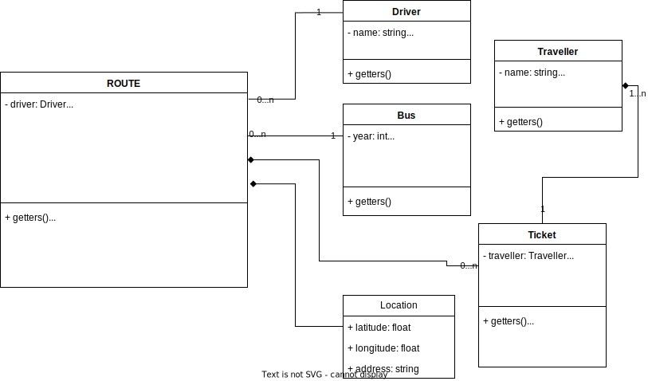
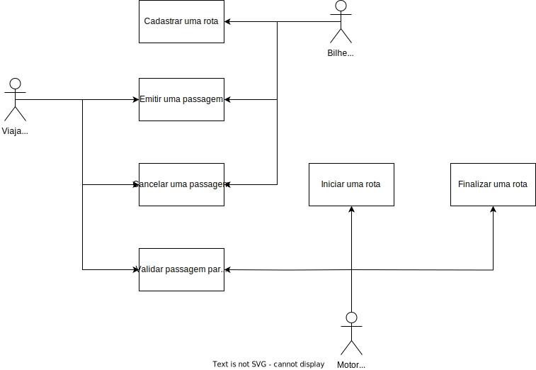

# BusGo - Bus Tourism Company

## WIP
This project is building... Consider see the branch [develop](https://github.com/mariosantosdev/bus-go/tree/develop) to see the current code.

## Introduction
BusGo is a simple application designed to manage a bus tourism company. This project was built using the principles of TDD, DDD and Clean Architecture in NestJS, a powerful Node.js framework for building scalable and efficient server-side applications.

## Diagrams

### Class Diagram

### Use case Diagram

## Platform Overview
BusGo offers a range of functionalities to efficiently manage your bus tourism business:

- **Ticket Office**: 
  - Create a route
  - Issue tickets for specific routes.
  - Allow for ticket cancellations on specific routes.

- **Driver**: 
  - Initiate and finish routes.
  - Read and validate passenger check-ins using ticket codes.

**Please note that this application is developed exclusively for educational purposes. It is not intended for production use.**

## Getting Started
1. Clone this repository to your local machine.
2. Install the necessary dependencies running `pnpm install` or `npm install`.
3. Configure environment variables and database connections (You can use the file `.env.example` to understand all the environment variables).
5. Run the project using `pnpm run start` or `npm run start` in yours respective directories.
